# ERP 智能问答与采购分析平台——系统设计与答辩讲解

> 版本：答辩版（2026-08-04）
> 系统定位：面向采购管理场景的只读智能问答、采购订单查询、经营分析与企业知识检索平台。

## 1. 一句话讲清系统

系统不是“把用户问题交给大模型直接回答”，而是把大模型放在一条**受身份、权限、工具契约、执行预算、证据和审计约束的业务链路**中：先理解完整语义，再选择通用问答、企业知识、采购业务数据、复合问答、澄清或拒绝路径，最后将结构化结果呈现为订单卡、表格、指标卡、ECharts 图表和折叠来源。

## 2. 建设目标与核心价值

| 目标 | 设计落点 | 业务价值 |
|---|---|---|
| 用户自然表达也能正确理解 | 整句语义路由 `SemanticRoutePlan` | 不依赖固定关键词，降低误路由 |
| 业务事实必须来自业务系统 | 采购 Tool + 统一采购数据 API | 避免模型凭空生成订单状态和经营指标 |
| 制度流程必须有依据 | WISE/IMA 多源知识检索 + 来源证据 | 回答可追溯、可核验 |
| 复杂问题一次完成 | LangGraph 多步编排 + 复合 Tool 调用 | 数据事实与制度知识可联合分析 |
| 企业场景安全可控 | Harness 身份、权限、预算、超时、审计 | 防越权、防失控、防数据串租户 |
| 结果直观可用 | Vue 3 + 表格/订单卡/指标卡/ECharts | 从“代码结果”升级为“业务决策界面” |

## 3. 总体系统架构

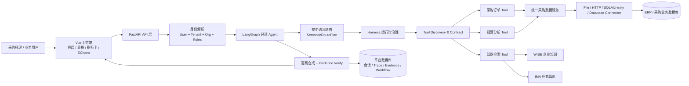

### 3.1 分层职责

1. **交互层**：负责会话、常用问题、答案组件化展示、来源折叠和删除交互。
2. **API 与身份层**：将 HTTP 请求转换为明确的用户、租户、组织和角色上下文。
3. **Agent 编排层**：LangGraph 控制“理解—调用—观察—合成—验证—响应”的循环。
4. **Harness 治理层**：在模型与真实系统之间执行权限、预算、超时、重试、恢复和审计。
5. **Tool 与数据层**：通过稳定的输入输出契约访问采购数据或知识源。
6. **持久化与可观测层**：记录会话、多轮交互、证据、Trace、工作流和策略决策。

## 4. 为什么不是关键词路由：整句语义路由设计

### 4.1 路由输出不是一个标签，而是一份执行计划

模型读取**完整问题与上下文**，生成结构化 `SemanticRoutePlan`：

```text
request_kind / domain / operation / entity
identifiers / filters / data_needs / evidence_need
confidence / required_tools / tool_arguments
missing_fields / clarification_question
```

随后 `routing.py` 只对结构化结果做规范化、必填项检查、Tool Contract 校验和安全收口；它不是靠“状态、流程、删除”等几个词直接决定路由。

### 4.2 五类问题的判定

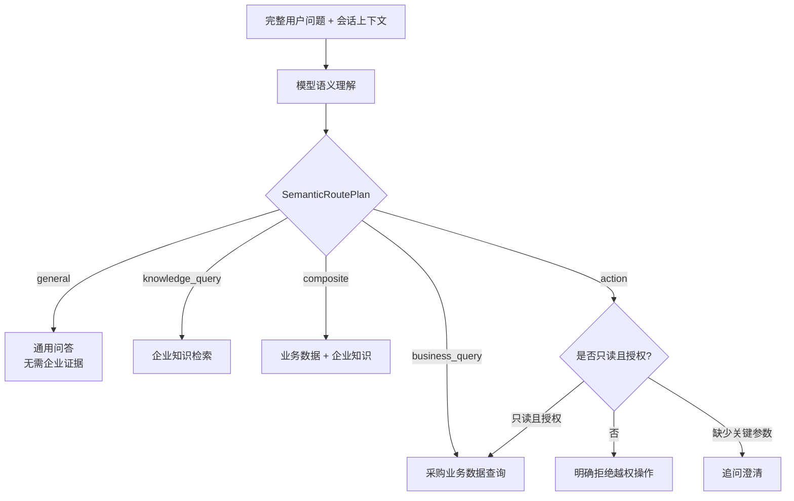

### 4.3 典型表达与正确路径

| 用户问题 | 语义判断 | 系统动作 |
|---|---|---|
| “哪些订单还没入库？” | 业务数据查询；筛选未入库 | 调 `procurement.orders.list`，返回订单表 |
| “订单现在什么状态？” | 业务查询，但缺订单号 | 进入澄清节点，追问订单编号 |
| “采购订单审批流程是什么？” | 企业制度知识 | 调 `knowledge.search`，答案附折叠来源 |
| “结合未入库订单和制度分析履约风险” | 复合问答 | 同时获取业务数据与知识证据，再联合分析 |
| “删除 PO202607001” | 写操作/高风险操作 | Harness 拒绝，不调用写入业务 Tool |

## 5. LangGraph 主编排

运行图定义：`platform.generic_readonly_agent@3.2.1`。

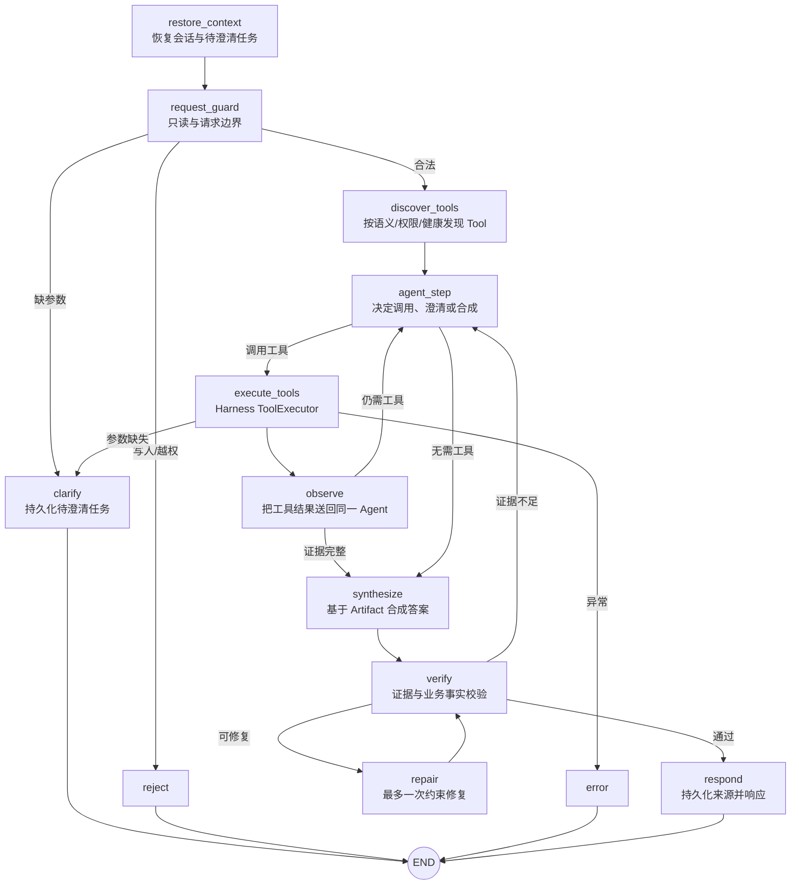

### 5.1 受控预算

| 预算 | 当前值 | 作用 |
|---|---:|---|
| 请求总超时 | 125 秒 | 防止链路无限等待 |
| 最大 Tool 调用 | 8 次 | 防止 Agent 无界循环 |
| 最大模型调用 | 8 次 | 控制成本和延迟 |
| 最大检索轮次 | 2 轮 | 允许补证据，但限制长尾 |
| 默认子查询 | 2 个 | 保留多角度检索，降低外部源串行延迟 |
| 默认完整性补查 | 0 | 缺失维度直接标为未知，不为普通问题强制二次补查 |

## 6. Tool 调用与数据契约

### 6.1 主要 Tool

| Tool | 输入重点 | 输出形态 | 用途 |
|---|---|---|---|
| `procurement.order.get` | `order_number` | 订单卡 | 查询单个订单状态、金额、供应商和履约信息 |
| `procurement.orders.list` | 状态、时间、组织、分页等筛选 | 订单表 | 未入库、逾期、状态分布等列表问题 |
| `procurement.analytics.query` | 时间范围、对比口径、指标 | 分析卡 + 图表数据 | 经营概览、趋势、品类结构和建议 |
| `knowledge.search` | 查询、知识域、证据需求 | 证据片段 | 制度、流程、操作规范和复合问答 |
| `data.business.query` | `dataset_id`?`fields`?`measures`?`dimensions`?`filters` | `DataArtifact` | ??????????????????????????????? SQL |

### 6.2 统一调用链

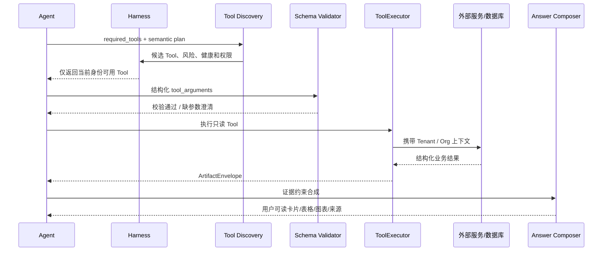

### 6.3 ??????????

- **??????**???? IAM / SSO ?? OIDC?OAuth2 ??? JWT ??????????? `IdentityContext`?`user_id`?`tenant_id`?`org_code`?`roles`???? Demo ????????????????????
- **?? RBAC / PDP**?????????????????? `business.data.read`?Tool Discovery / Execute??????????????????Discovery ? Execute ??? fail-closed ??????
- **??????**?WISE????ERP ??????????????????? Credential Broker?OBO ? Token Exchange ??????????? Demo ??? JWT ????? Header ???????????????????

## 7. Harness 机制：让 Agent 可控、可审计、可恢复

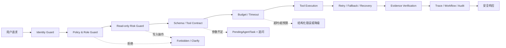

### 7.1 Harness 与普通 Agent 框架的区别

- Tool 不是“模型想调就调”，必须同时满足：语义匹配、注册存在、健康可用、身份授权、风险允许、参数合法。
- 每次运行都有模型、Tool、检索和时间预算。
- 订单事实被冻结后进入验证，避免回答合成阶段改写关键业务数据。
- 普通用户只看到业务结论；Tool envelope、connector、模型版本、Mock 技术字段仅用于内部调试和审计。
- 故障可降级：例如 IMA 配额不足时仍可使用 WISE 证据完成回答。

## 8. 采购数据库与服务对接

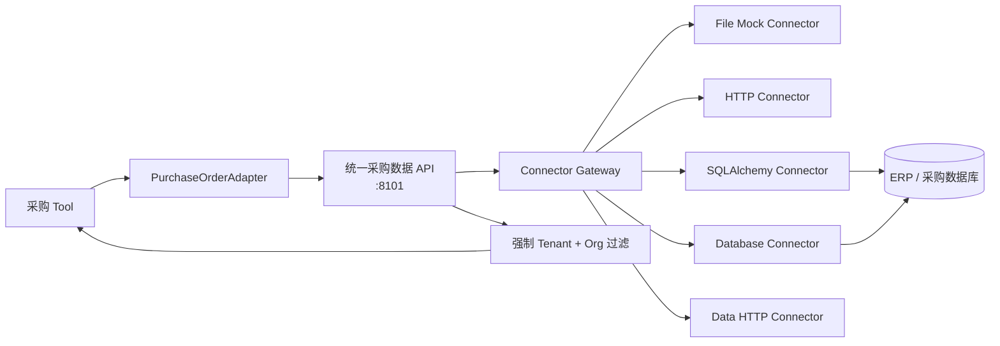

### 8.1 可替换 Connector 的意义

演示环境当前使用 SQLite demo connector，验证的是**业务契约、查询控制流和租户组织隔离**。切换生产环境时只需配置真实数据库或 HTTP Connector，Agent 路由、Tool Schema 和前端展示契约不需要重写。

### 8.2 数据访问原则

1. 所有采购查询传递 `X-Tenant-Id` 和 `X-Org-Code`；
2. 查询条件在服务端再次收口，前端会话 ID 不能作为权限凭证；
3. 当前业务 Tool 全部只读，不提供新增、审批、删除或修改采购数据能力；
4. 真实数据库验证与本地 SQLite/Mock 契约验证在答辩中明确区分。

## 9. WISE + IMA 知识检索子图

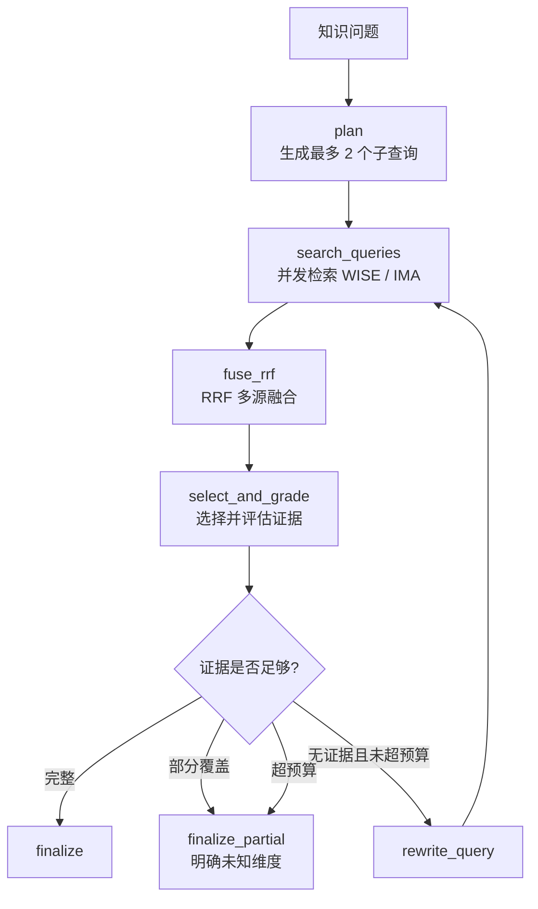

### 9.1 来源策略

- WISE 作为企业内部权威知识源；
- IMA 用于通用补充；
- 来源冲突时优先企业内部证据；
- 来源在 UI 中默认只显示文档标题，点击后才展开片段和外部链接；
- `source_id` 等内部标识不直接展示给普通用户。

## 10. 经营分析与可视化

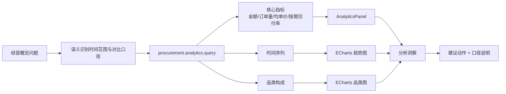

经营分析回答不是展示底层 JSON 或代码，而是：

1. 先给一句管理摘要；
2. 展示 4 个核心指标卡及同比/环比变化；
3. 展示趋势和品类结构图；
4. 给出数据驱动的洞察和建议；
5. 明确统计周期、截止日期和口径边界。

## 11. 会话历史与来源持久化

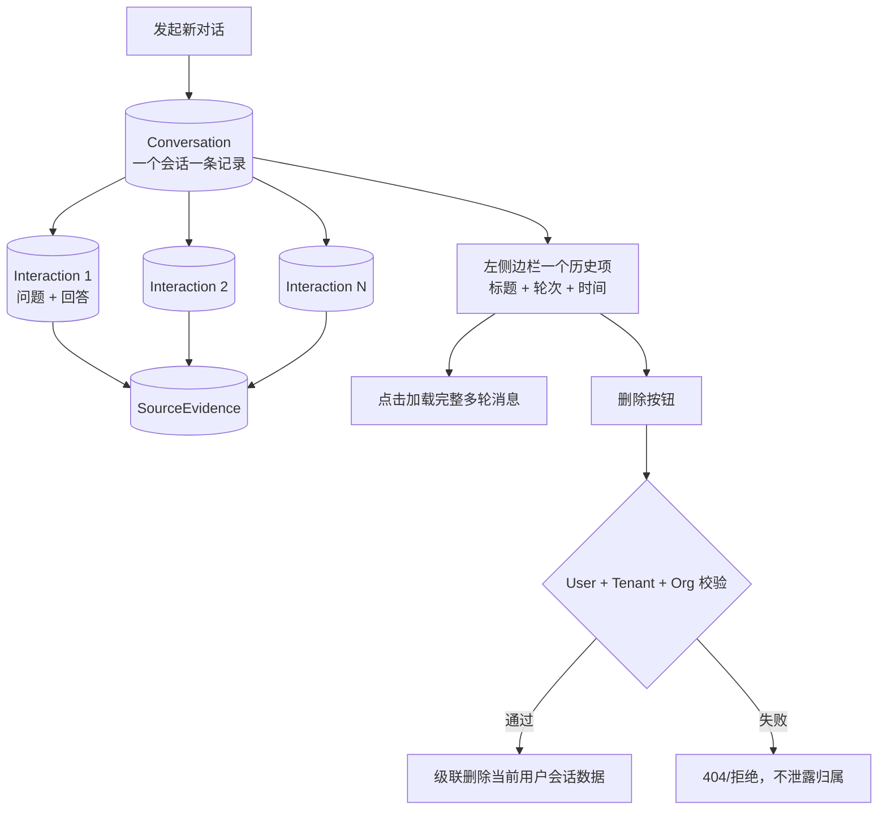

关键设计：

- `Conversation` 是一个对话窗口；`Interaction` 是该会话中的一轮问答；
- 边栏绝不按每句话生成历史项；
- 删除当前会话后同步清理前端 active session 和 localStorage；
- 常用问题位于固定输入区，回答后仍保留；
- 来源使用 `<details>` 折叠展示，避免把片段全部摊开。

## 12. 身份、租户、组织与权限隔离

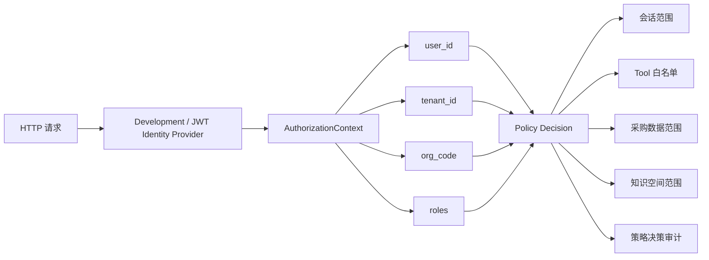

权限不是只在 UI 隐藏按钮，而是在 API、Repository、ToolExecutor 和数据服务多个边界重复校验。

## 13. 平台数据库设计

平台侧共 19 张业务表，可归纳为 6 组：

| 领域 | 主要表 | 职责 |
|---|---|---|
| 会话 | `conversations`, `interactions`, `pending_agent_tasks` | 多轮上下文、澄清恢复 |
| 证据与反馈 | `source_evidence`, `answer_feedback` | 来源追溯、用户反馈 |
| Trace | `trace_spans` | 调用链和耗时观测 |
| Workflow | `workflow_runs`, `workflow_node_runs`, `workflow_tool_calls`, `workflow_policy_decisions`, `verification_runs` | LangGraph/Harness 执行审计 |
| 平台治理 | `platform_config_versions`, `evaluation_runs` | 配置版本和评测 |
| 数据治理 | `data_source_connections`, `data_source_access_grants`, `data_source_approval_requests`, `semantic_models`, `semantic_model_versions`, `data_governance_audit` | 数据源、授权、语义模型和审计 |

当前 Alembic 迁移已升级到 `20260731_0012`。

## 14. 五个功能流程

### 14.1 单订单状态

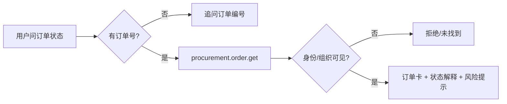

### 14.2 未入库订单

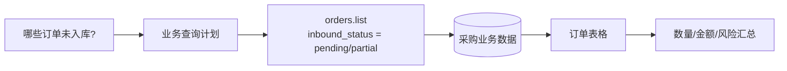

### 14.3 制度知识问答

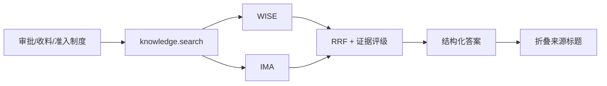

### 14.4 复合履约风险分析

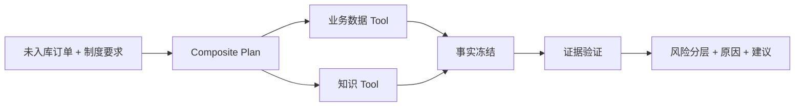

### 14.5 越权操作

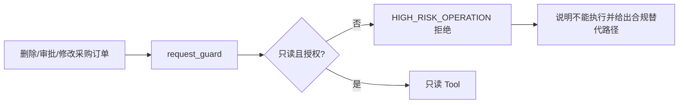

## 15. 可观测性、降级与质量保障

### 15.1 运行时可观测

每次请求可记录：

- Graph 节点进入/退出和耗时；
- Tool 调用、输入摘要、结果状态；
- 策略决策和拒绝原因；
- 来源证据与验证结果；
- 错误、重试、降级和恢复状态。

### 15.2 故障降级

| 故障 | 处理 |
|---|---|
| IMA 配额不足 | 保留 WISE 企业知识结果，不让整次问答失败 |
| Tool 缺少参数 | 持久化 `PendingAgentTask`，向用户追问 |
| Tool 不健康/无权限 | 不向模型暴露该 Tool，返回受控错误或替代路径 |
| 答案证据不足 | 补取证据或标记未知，不编造确定结论 |
| 请求超时/超预算 | 结构化终止，保留 Trace 便于定位 |

### 15.3 当前验证证据

| 范围 | 结果 |
|---|---|
| 后端全量测试 | `234 passed in 159.20s` |
| 采购数据服务全量测试 | `45 passed in 8.48s` |
| 前端类型检查与生产构建 | `vue-tsc + Vite build PASS` |
| 本地 HTTP 关键路径验证 | 知识/业务/复合/澄清/越权拒绝等 6 类路径均命中预期 |
| 浏览器交互 | 会话多轮、删除、常用问题固定、来源折叠、经营图表均已验证 |

边界说明：上述证据均为 2026 年 8 月 4 日的本地代码回归、Connector 契约验证和本地 HTTP 链路验证。WISE、IMA、模型网关和真实生产采购数据库属于外部服务，本地结果不能替代生产环境的网络、权限、数据口径和容量验收；IMA 上游配额异常时，代码路径已验证可受控降级。

## 16. 性能优化结论

| 路径 | 优化前 | 优化后 | 主要措施 |
|---|---:|---:|---|
| 订单状态澄清 | — | 约 2.8 秒 | 无需 Tool 时直接澄清 |
| 未入库订单 | — | 约 3.6 秒 | 单业务 Tool 直达 |
| 经营分析 | — | 约 3.0 秒 | 结构化指标直接渲染 |
| 知识问答 | 约 22 秒 | 约 11–13 秒 | 子查询 4→2、关闭默认补查、收敛模型上下文 |
| 复合问答 | 约 21.9 秒 | 约 17 秒 | 限制知识块和模型输出预算 |

性能优化坚持“**减少无收益调用，不删除必要控制**”：仍保留最多 2 轮检索、证据评级、答案验证、超时和审计。

## 17. 答辩演示建议

建议按“从简单到复杂、从价值到治理”的顺序演示：

1. **订单状态缺编号**：输入“订单现在什么状态”，展示系统主动追问而不是猜测；
2. **未入库订单**：输入“哪些采购订单还没有入库”，展示真实业务表格；
3. **经营概览**：输入“本季度采购经营概览”，展示指标卡、趋势、品类、洞察和建议；
4. **制度问答**：输入“采购订单审核后如何收料”，展示企业知识和折叠来源；
5. **复合问答**：输入“结合未入库订单和采购制度分析履约风险”，展示多 Tool 联合；
6. **安全拒绝**：输入“删除 PO202607001”，展示 Harness 只读护栏。

## 18. 3 分钟讲稿

“本系统解决的不是一个普通聊天机器人问题，而是企业采购场景中‘自然语言如何安全、准确地连接业务数据和企业知识’的问题。整体上，前端接收用户问题，FastAPI 建立用户、租户、组织和角色上下文；LangGraph 根据完整语义生成结构化执行计划，将问题分为通用、知识、业务、复合、澄清和拒绝路径。真正的业务事实必须通过只读 Tool 查询采购服务，制度流程必须通过 WISE 或 IMA 检索证据。Harness 位于模型与系统之间，统一控制 Tool 权限、输入输出契约、调用预算、超时、降级、恢复和审计。答案生成后还要进行证据和业务事实校验，最后以订单卡、表格、指标卡和 ECharts 图表展示。会话层采用一个 Conversation 对应一个对话窗口、多个 Interaction 对应多轮消息，并按用户、租户和组织隔离。这样既保留了大模型对自然语言的理解能力，又满足企业系统对准确性、安全性、可追溯和可运维的要求。”

## 19. 答辩高频问题

### Q1：为什么不用关键词路由？
关键词只能反映局部词面，无法可靠处理同义改写、否定、上下文和一个问题包含多个意图。本系统使用完整语义生成结构化计划，规则只负责契约校验和安全收口。

### Q2：如何避免大模型编造订单数据？
订单事实只能来自采购 Tool 的结构化 Artifact；关键业务事实进入验证阶段，不允许模型自行改写。无证据时明确未知或追问。

### Q3：如何接入真实 ERP？
采购数据服务通过 Connector Gateway 隔离数据源差异。将 SQLite demo connector 替换为生产 Database、SQLAlchemy 或 HTTP Connector 即可，Agent、Tool Schema 和前端保持稳定。

### Q4：Harness 的核心价值是什么？
它把不确定的大模型推理转换成可控的企业执行：身份可控、Tool 可控、预算可控、失败可恢复、结果有证据、全过程可审计。

### Q5：当前还有哪些边界？
外部知识源和模型受网络与配额影响；ECharts Canvas 包体仍有约 555 KB 的非阻断优化空间；生产采购数据库需要单独完成真实 Connector、权限和指标口径验收。
